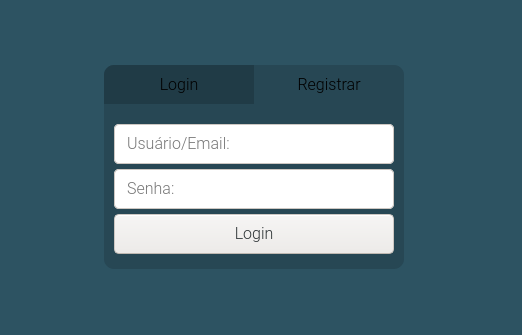
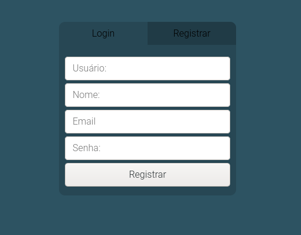

# CRUD com PHP

Este projeto tem como objetivo demonstrar meus conhecimentos em HTML, CSS, JS, PHP e MySQL.

## Projeto

Um CRUD bem simples, o usuário pode fazer o registro colocando nome de usuário, nome, email e senha. Você pode fazer login com seu nome de usuário ou email, estando tudo certo você segue para a tela principal. Na tela principal além de mostrar o seu email e nome de usuário, você pode deletar sua conta ou alterar seus dados e também pode sair do sistema.